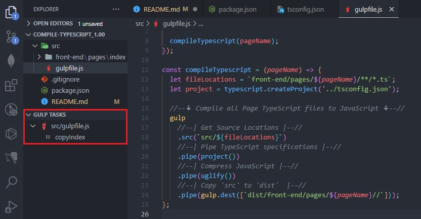

### Tutorial References

To make use of the command terminals provided below, it's essential to have [Node.js](https://nodejs.org/en) installed on your system. The compiling process for [TypeScript](https://en.wikipedia.org/wiki/TypeScript) is streamlined using [Gulp Tasks](https://marketplace.visualstudio.com/items?itemName=nickdodd79.gulptasks) within [Visual Studio Code](https://code.visualstudio.com/).

> Terminal Commands

    npm init -y
    npm install --save-dev gulp
    npm install --save-dev gulp-uglify
    npm install --save-dev gulp-typescript

The configuration file, [gulpfile.js](https://github.com/TertiusRoach/compile-typescript_1.00/blob/main/src/gulpfile.js), is situated in the [src](https://github.com/TertiusRoach/compile-typescript_1.00/tree/main/src) directory, a strategic placement that prevents unnecessary clutter in the [root](https://github.com/TertiusRoach/compile-typescript_1.00/tree/main) folder.

> Gulpfile Code

`
    const gulp = require('gulp');
    const uglify = require('gulp-uglify');
    const typescript = require('gulp-typescript');

    gulp.task('copyIndex', async () => {
    let pageName = 'index';

    compileTypescript(pageName);
    });

    const compileTypescript = (pageName) => {
    let fileLocations = `front-end/pages/${pageName}/**/*.ts`;
    let project = typescript.createProject('../tsconfig.json');

    //--🠋 Compile all Page TypeScript files to JavaScript 🠋--//
    gulp
    //--| Get Source Locations |--//
    .src(`src/${fileLocations}`)
    //--| Pipe TypeScript specifications |--//
    .pipe(project())
    //--| Compress JavaScript |--//
    .pipe(uglify())
    //--| Copy 'src' to 'dist' |--//
    .pipe(gulp.dest([`dist/front-end/pages/${pageName}//`]));
    };

`
